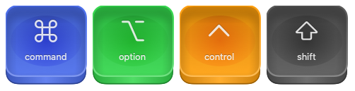

# ⌨️ KeycapView

KeycapView is a customizable SwiftUI component for creating keycap-like UI elements with support for images, text, dynamic sizes, and skewed perspective.
Inspired by the [MacOS Keystroke Generator](https://www.figma.com/community/file/1243912940361668224/macos-keystroke-generator) Figma design.



## Features

- Customizable text and image content using `@ViewBuilder` closures.
- Adjustable sizes: small, medium, large, or custom.
- Tint color customization with gradient effects.
- Interactive press animation.
- Optional skewed 3D perspective for realistic rendering.

## Installation

Add the `KeycapView` Swift file to your SwiftUI project.

## Usage

Here's how to integrate `KeycapView` into your SwiftUI project:

```swift
import SwiftUI

struct ContentView: View {
    @State private var isPressed = false

    var body: some View {
        KeycapView(
            image: {
                Image(systemName: "command")
                    .resizable()
                    .aspectRatio(contentMode: .fit)
                    .frame(width: 32, height: 32)
            },
            text: { Text("command") },
            isPressed: $isPressed,
            size: .medium,
            tintColor: Color.blue,
            shouldSkew: true
        )
    }
}
```

## Parameters

| Parameter      | Type                        | Description                                                  |
|----------------|-----------------------------|--------------------------------------------------------------|
| `image`        | `@ViewBuilder () -> View`   | Optional closure to provide the image content.               |
| `text`         | `@ViewBuilder () -> View`   | Optional closure to provide the text content.                |
| `isPressed`    | `Binding<Bool>`             | Binding to track the press state of the keycap.              |
| `size`         | `KeycapView.Size`           | Size of the keycap (`.small`, `.medium`, `.large`, `.custom`).|
| `tintColor`    | `Color`                     | Base color for the gradient effect.                          |
| `shouldSkew`   | `Bool`                      | Flag to enable or disable 3D skewed perspective.             |

## Example Previews

Here are some example previews to get started:

```swift
#Preview {
    let skew = false
    VStack {
        HStack {
            Text("Normal buttons")
            Spacer()
        }
        HStack(spacing: 20) {
            KeycapView(
                image: {
                    Image(systemName: "command")
                        .resizable()
                        .aspectRatio(contentMode: .fit)
                        .frame(width: 32, height: 32)
                },
                text: { Text("command") },
                isPressed: .constant(false),
                tintColor: Color.blue,
                shouldSkew: skew
            )
            KeycapView(
                image: {
                    Image(systemName: "option")
                        .resizable()
                        .aspectRatio(contentMode: .fit)
                        .frame(width: 32, height: 32)
                },
                text: { Text("option") },
                isPressed: .constant(false),
                tintColor: .green,
                shouldSkew: skew
            )
        }
    }
}
```

## License

This project is licensed under the MIT License. See the LICENSE file for details.

## Contributions

Contributions, issues, and feature requests are welcome! Feel free to submit a pull request or open an issue.

---
